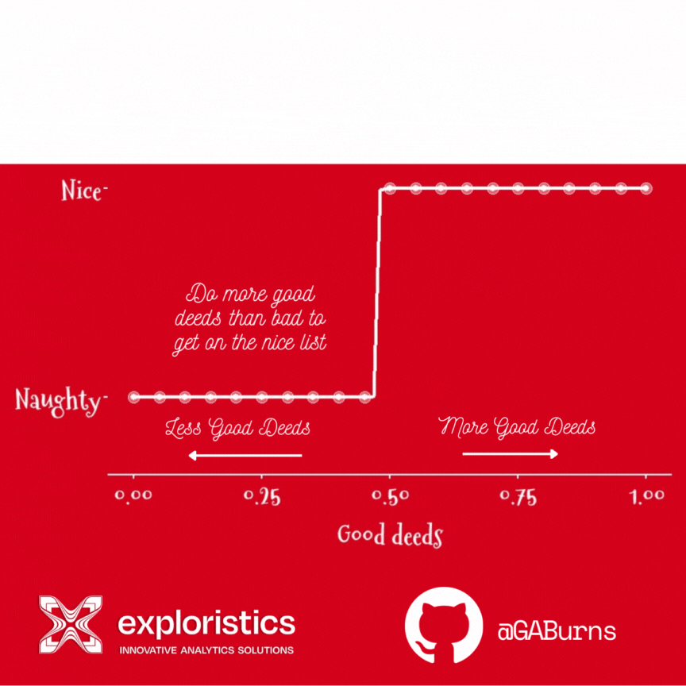

# 12 Plots of Christmas 🎄🎅

Welcome to the 12 Plots of Christmas repository! In this project, we showcase a collection of 12 different plots created using R (& SAS) programming language to celebrate the holiday season.

## Plots

Each plot represents a unique visualization related to Christmas themes and data analysis. Here's a brief overview of the plots:

1.  **Bumpchart animation**: A bump chart of the relative UK Chart positions of 5 classic Christmas songs.

2.  **Logistic Regression:** Does Santa use logistic regression to write the nice list?

3.  **Bouncing Brussels Sprout:** An animation of showing time series data of Google Search Trends for "*Brussels Sprout***"** in 2022

    

## How to Run

To recreate these plots or explore the code, follow these steps:

1.  Clone this repository to your local machine using `git clone https://github.com/GABurns/12plotschristmas.git`.
2.  Make sure you have R installed on your system.
3.  Open RStudio or any R environment.
4.  Navigate to the directory where the repository is cloned.
5.  Install the associated packages (e.g. ggplot2)
6.  Run the R scripts associated with each plot to generate the visualizations.

***Note** some post plot creation graphic design was applied in third party tools.*

## Contributing

If you'd like to contribute your own Christmas-themed plots or improvements to existing ones, feel free to fork this repository, make changes, and create a pull request.

## Code of Conduct

Please note that the *12 Plots of Christmas* project is released with a [Contributor Code of Conduct](https://contributor-covenant.org/version/2/1/CODE_OF_CONDUCT.html). By contributing to this project, you agree to abide by its terms.

## Acknowledgements

Special thanks to

-   Caroline O'Hare

-   Amy McCorry

-   Emily Rogan

-   Dearbhala Quinn

-   Eoghan Devlin

for contribution, inspiration and guidance in creating these plots.

------------------------------------------------------------------------

Enjoy the holiday season with these festive visualizations! 🎄✨
