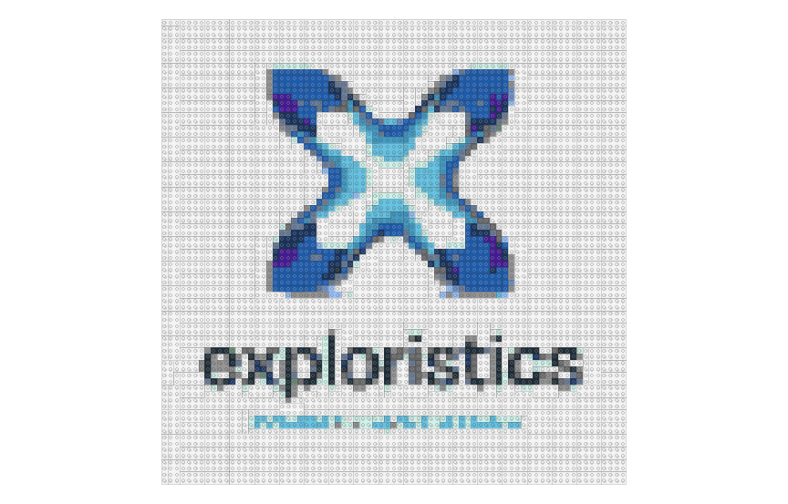

# 12 Plots of Christmas 🎄🎅

Welcome to the [Exploristics](https://www.linkedin.com/company/exploristics/) 12 Plots of Christmas repository! In this project, we showcase a collection of 12 different plots created using R (& SAS) programming language to celebrate the holiday season.

# Table of contents

1.  [Plots](#plots)
    1.  [UK Fav Christas Song](#plot1)
    2.  [Naughty or Nice?](#plot2)
    3.  [Bouncing Brussels Sprout](#plot3)
    4.  [Birds of Christmas](#plot4)
    5.  [Christmas Tree Distribution](#plot5)
    6.  [Fa-La Bar Plot](#plot6)
    7.  [Die Hard is categorically a Christmas Movie](#plot7)
    8.  [Lego Logo Mosaic](#plot8)
    9.  [Christmas Gift Spending](#plot9)
    10. [Chimneys Visited Animation](#plot10)
    11. [12 Days of Christmas Gifts](#plot11)
    12. [Santa Wordcloud](#plot12)
2.  [How to recreate](#recreate)
3.  [Contributing](#contributing)
4.  [Code of Conduct](#codeofconduct)
5.  [Acknowledgements](#acknowledgements)

## Plots  {#plots}

Each plot represents a unique visualization related to Christmas themes and data analysis. Here's a brief overview of the plots:

### **UKs Favorite Christmas Song** 

A bump chart of the relative UK Chart positions of 5 classic Christmas songs.

### Naughty or Nice? 

Does Santa use logistic regression to write the nice list?

### Bouncing Brussels Sprout 

An animation of showing time series data of Google Search Trends for "*Brussels Sprout***"** in 2022.

        

### Birds of Christmas 

A Step Chart showing the cumulative total of birds gifted from the Christmas Carol "12 Days of Christmas".

       

### Christmas Tree Distribution 

Use of Christmas tree icons to represent individual data points to show normal distribution that looks like Christmas tree.

### Fa-La Bar Plot 

Cryptic Quiz and DRY principle!

       

### *Die Hard is categorically a Christmas Movie* 

Christmas line chart that demonstrates *Die Hard is categorically a Christmas Movie*.

        

### Lego Logo Mosaic 

Use of [brickr](https://brickr.org/) package 📦 to create a Exploristics Lego Logo Mosciac.

### Christmas Gift Spending 

Bar chart of average UK spend on Christmas gifts per year. The use of labels using `geom_text` to look like bow is something I'm really proud of!

       

### Chimneys Visited Animation 

Winter wonderland background with exponential growth of chimneys visited.

### 12 Days of Christmas Gifts 

Bar chart created using **SAS** displaying the number of gifts gifted during the 12 days of Christmas.

      

### Santa Wordcloud 

A word-cloud displaying the many names of Old Saint Nic!

        

## How to Recreate 

To recreate these plots or explore the code, follow these steps:

1.  Clone this repository to your local machine using `git clone https://github.com/GABurns/12plotschristmas.git`.
2.  Make sure you have R installed on your system.
3.  Open RStudio or any R environment.
4.  Navigate to the directory where the repository is cloned.
5.  Install the associated packages (e.g. ggplot2)
6.  Run the R scripts associated with each plot to generate the visualizations.

***Note** some post plot creation graphic design was applied in third party tools.*

## Contributing  {#contributing}

If you'd like to contribute your own Christmas-themed plots or improvements to existing ones, feel free to fork this repository, make changes, and create a pull request.

## Code of Conduct 

Please note that the *12 Plots of Christmas* project is released with a [Contributor Code of Conduct](https://contributor-covenant.org/version/2/1/CODE_OF_CONDUCT.html). By contributing to this project, you agree to abide by its terms.

## Acknowledgements  {#acknowledgements}

Special thanks to

-   Caroline O'Hare

-   Amy McCorry

-   Emily Rogan

-   Dearbhala Quinn

-   Eoghan Devlin

for contribution, inspiration and guidance in creating these plots.

------------------------------------------------------------------------

Enjoy the holiday season with these festive visualizations! 🎄✨
